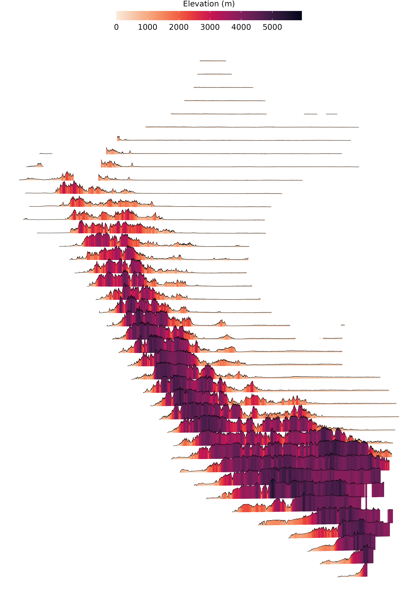

<h1 align="center"><b>Elevation viz</b></h1>

     

## **Characteristics**
<table class="default" align="center">
  <tr align="center">
    <td><b>Operative System</b></td>
    <td><b>Software</b></td>
    <td><b>Library</b></td>
    <td><b>RAM memory</b></td>
  </tr>
  <tr>
    <td>Pop! OS 21.04 (hirsute)</td>
    <td><li>R/Rstudio</li></td>
    <td> <li>rgee</li><li>plyr</li><li>raster</li><li>sf</li><li>qgisprocess</li></td>
    <td align="center"> 15 gb </td>
  </tr>
</table>

## **Elevation viz map**

